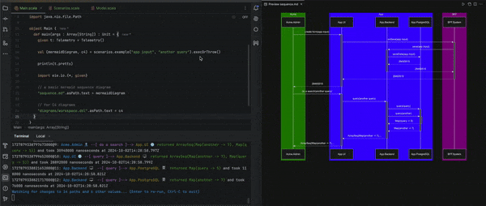

# logic-first

"*Logic First*" is a software approach of using working software as a means to design and run your system architecture.

The approach is to use your business logic (data models, APIs and flow) as an "executable architecture" for creating key documentation for your system as you build it.

Using working software (actual interfaces and data types) addresses a major flaw of traditional waterfall architecture:

```
Does the thing you built match what was designed?
```

Documentation and diagrams very rarely change with software as it evolves.

Using software as the "source of truth" (tm) for creating the documentation realises a number of benefits:

* Our architecture 'compiles' -- we identify issues much earlier, and utilise the compiler as immediate feedback
* There is no documentation drift -- if you're looking at a diagram of your system, you know that's how it works
* It tightens the feedback loop and connection between the software system and the data you use to drive it
* You get diagrams which cover all the cases (not just happy-path), and which can compose (e.g. cover components, as well as the entire system)

## How does it work?

Technically 'logic-first' is an approach you could take with any language. However, if we're talking data models and interfaces, scala 3 is hands-down the simplest, yet most expressive and powerful way to do this.

Given that, here is how to get started using this library/process:

1. Create a new project using the [logic-first.g8](https://github.com/kindservices/logic-first.g8) template using [sbt](https://www.scala-sbt.org/): `sbt new kindservices/logic-first.g8`


2. Model your application. 
    
   You don't need to do anything to start with - the new project works out-of-the-box, as there is an existing [Model.scala](https://github.com/kindservices/logic-first.g8/blob/main/src/main/g8/shared/src/main/scala/%24pckg__packaged%24/Model.scala) as a starting point. 

   See [here](./docs/modeling.md) for how to model your own application.

3. Create the diagrams from your model:

    #### Run `make c4` and open [localhost:8090](http://localhost:8090):
  
    

    #### Run `make sequence` and open `./diagrams/sequence.md` or `./diagrams/sequence-1.png`:
   
    

4. Iterate!

    In the above step, what just happened was:

   * we modeled our software
   * we created a scenario which sent some data through that software
   * we used the recorded telemetry from that scenario to create and view some diagrams (C4, Sequence, whatever) 

        * We can add new scenarios, change data models or interfaces, and tweak the logic to see how those diagrams change.

        * Use `make watch` to automatically regenerate the models as you change your models (code) and scenarios (data).
    It's useful to e.g. have the sequence.md open in your IDE in previous mode to see it change as you code:

        

5. Next Steps

    Once you have the APIs and data models which represent your application, you can 'promote' those APIs into more formal
    definitions, such as an openapi contract.

    Because you used code to design your system, you can also package up your APIs and interfaces to be brought in as dependencies in your actual components.

    #### API Contracts 
    Once you're happy with your design and flow, you can take your APIs and data models and convert them into [openapi specs](https://www.openapis.org/).
    
    Put your local code into `./schemas/<name>/openapi.yml` (or copy the example) and run `make generateModels`. 

    This gives you a [contract-first](https://swagger.io/resources/articles/adopting-an-api-first-approach/) model for your services.  

    #### Deploy your architecture
    Your scala code can compile to the JVM and Javascript. Your project is already set up to have a github pipeline which publishes to both runtimes so they can be consumed as a library by your front-end or back-end implementations.
    
    Get in touch if you'd like a demonstration of how to do this.

## Building this project

This project is built using [sbt](https://www.scala-sbt.org/download/) and made available both as `javascript` and `jar`.


