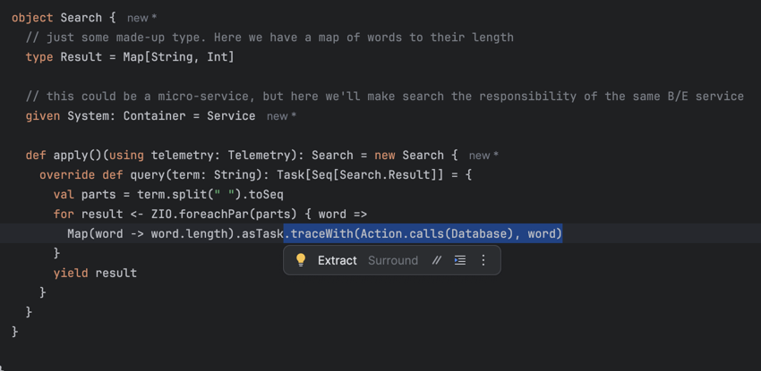

[back](../readme.md)

# Modeling

By "Modeling", we just mean writing normal data structures and interfaces for APIs like you're used to.

For example, the ['Model.scala'](https://github.com/kindservices/logic-first.g8/blob/main/src/main/g8/shared/src/main/scala/%24pckg__packaged%24/Model.scala) which got created as part of [the g8 template](https://github.com/kindservices/logic-first.g8) has a 'Search' interface:

```scala
  trait Search {
    def query(term: String): Task[Seq[Search.Result]]
  }
```

Which just says "Given some search term, return a Task that returns a list (sequence or 'Seq') of search results".

## What is 'Task'?
If the ['Task'](https://zio.dev/reference/core/zio/task/) looks unfamiliar, it comes from the [ZIO](https://zio.dev/) library. 

A good way to think about it is like a Future (or Promise) on steroids, as a Task is something which (1) isn't eagerly running like a Future does and (2) it can be canceled, retried, mapped, etc.

The reason we chose 'Task' is that it can represent error cases, asynchronous calls, and anything else you'd potentially need a good API contract to do.

## Turning logic into diagrams

Ok - so we have our first bit of code. How is that going to create any architecture diagrams?

The approach this 'logic-first' library takes is to instrument the calls with the data needed to create those diagrams:

 1. The caller and callee [containers (using the term from C4)](https://c4model.com/abstractions/container). 
 2. The name of the operation
 3. The data (inputs and return values) from the calls

To do this, we create the containers (just basic data structures) which will represent the actors of our system (people, services, apps, databases, queues, etc).

In this case, there is some user interface, a back-end service, a database, and an admin person:
### The Containers
```scala
val UI: Container       = Container.webApp("App", "UI")
val Service: Container  = Container.service("App", "Backend")
val Database: Container = Container.database("App", "PostgreSQL")
val Admin: Container = Container.person("Acme", "Admin")
```

### Using Containers with Task.traceWith(< action >, < input >)

When we then provide a basic (fake, mock, whatever you want to call it) implementation of a function, we use the *'.traceWith(< action >, < input >)'* function as the means to annotate that call:



The *'Action.calls(< target >)'* creates an Action object:

```scala 3
case class Action(source: Container, target: Container, operation: String)
```
by using an [implicit (given)](https://docs.scala-lang.org/scala3/reference/contextual/givens.html) Container as the source:

```scala 3
given System: Container = Service
```

with the target container as the parameter:
```scala 3
Action.calls(Database)
```
And the operation name we can derive by using [Li Haoyi's excellent sourcecode macro](https://github.com/com-lihaoyi/sourcecode).
That is to say, we don't have to explicitly pass in "search" as the name of the operation when we use `.traceWith`, though we could if we wanted.

### Adding Telemetry

The last piece of the puzzle is the [Telemetry](../shared/src/main/scala/kind/logic/telemetry/Telemetry.scala) trait, which is what writes down what calls get made, how long they take, etc.

We need a given instance of Telemetry in-scope to use *Task.traceWith* function described above:

```scala 3
    def apply()(using telemetry: Telemetry): Search = new Search {
      override def query(term: String): Task[Seq[Search.Result]] = {
        val parts = term.split(" ").toSeq
        for result <- ZIO.foreachPar(parts) { word =>
          Map(word -> word.length).asTask.traceWith(Action.calls(Database), word)
        }
        yield result
      }
    }
```

After we run our application, we can ask the `Telemetry` object to create diagrams of what was run.

### Scenarios

With our APIs defined and augmented with 'traceWith', we can create a scenario which exercise our software.

For example, here's a scenario which introduces the 'Admin' user as kicking off two actions:
 * saving some data
 * querying for some term

It then ends the scenario by asking the Telemetry to create a 'mermaid' sequence diagram and 'c4' diagram:

```scala 3
  def exampleScenario(data : String, queryString : String)(using t: Telemetry) = {
    for
      _ <- (data.asTask *> BFF.save(data).traceWith(Action(UI, BFF.System, "onSave"), data)).traceWith(Action(Admin, UI, "create form"), data)
      queryApi    = Search()
      userQuery <- (queryString.asTask *> queryApi
        .query(queryString)
        .traceWith(Action(UI, Service, "query"), queryString))
        .traceWith(Action(Admin, UI, "do a search"), queryString)
      mermaid <- t.mermaid
      c4      <- t.c4
    yield (mermaid.diagram(), c4.diagram())
  }
```

Finally, we have a 'Main' entrypoint which runs that scenario and writes the output to stdout, then persists the diagrams to the filesystem:

```scala 3
    given t: Telemetry = Telemetry()

    val (mermaidDiagram, c4) = scenarios.example("other input", "the quick brown fox").execOrThrow()

    println(t.pretty)

    // a basic mermaid sequence diagram
    "diagrams/sequence.md".asPath.text = mermaidDiagram

    // for C4 diagrams
    "diagrams/workspace.dsl".asPath.text = c4
```

# Wrapping up

That was the detail of how this 'logic-first' plumbing fits together.

In practice, once you're familiar with 'Task' and just using '.traceWith', writing code this way is quite robust, and tightens the loop of:

1. write code
2. squirt data through it
3. see visual results of what your code did


[back](../readme.md)
